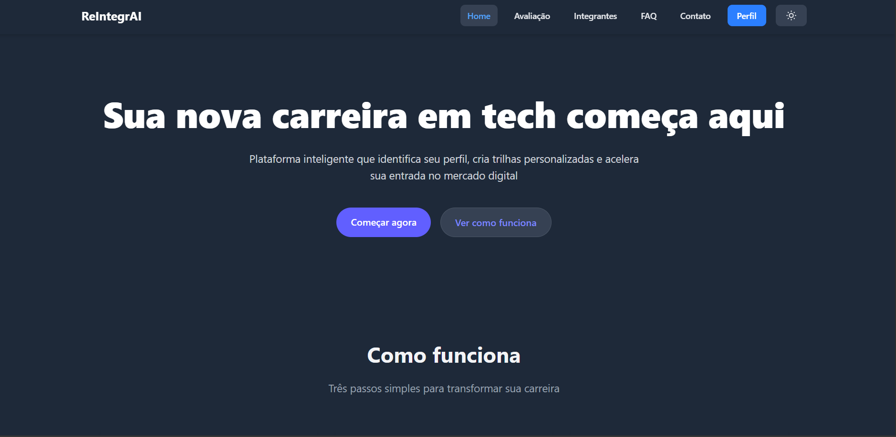
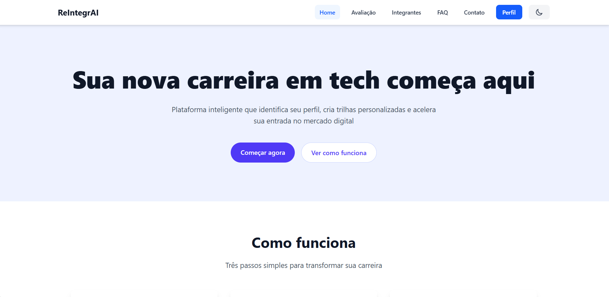
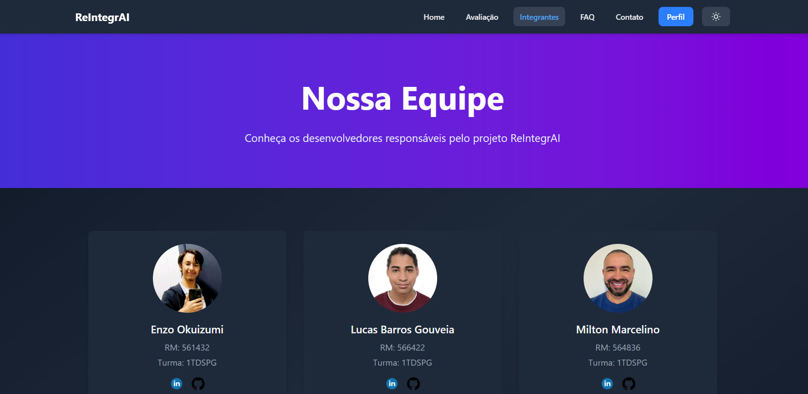
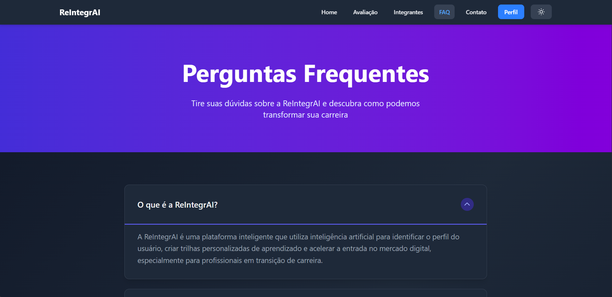
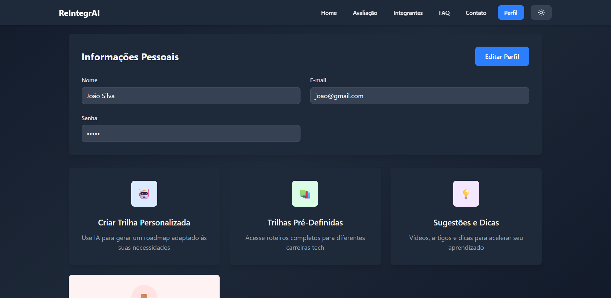
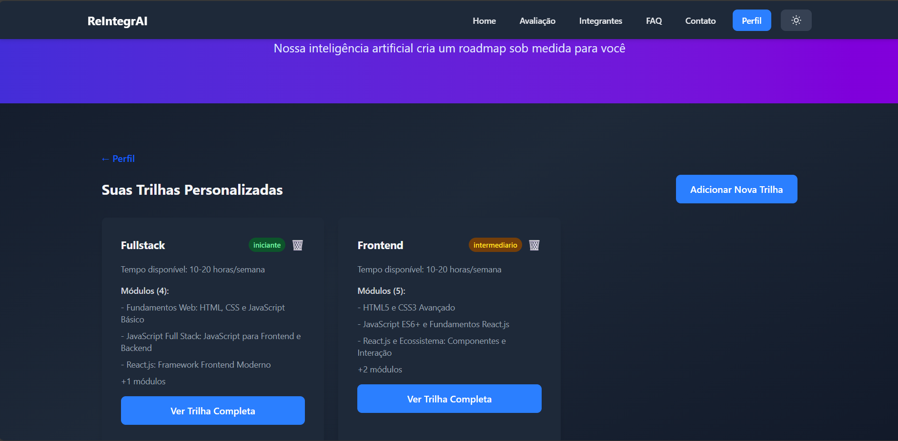
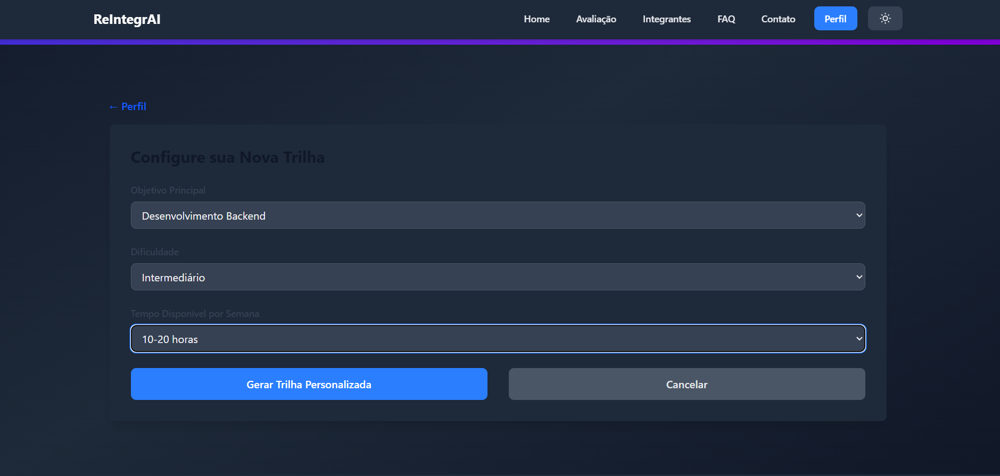
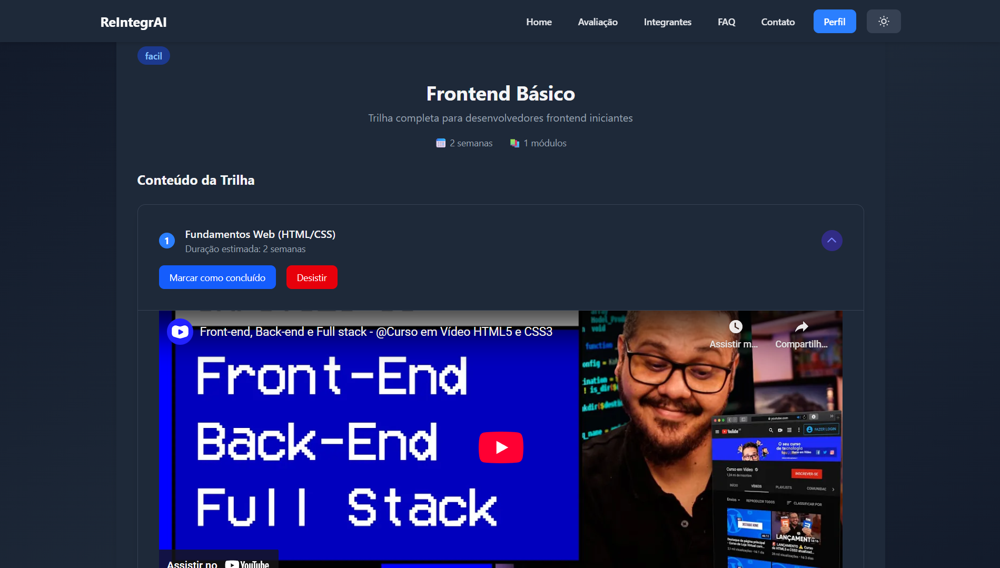
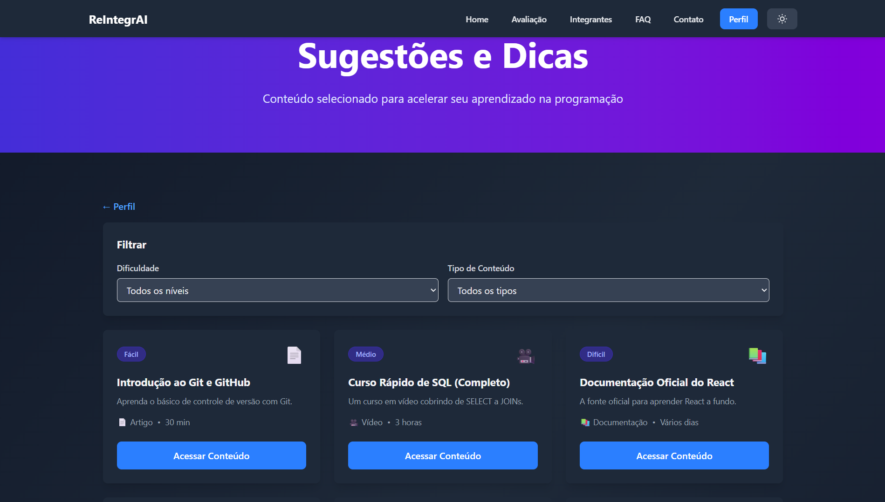

# ReIntegra - Global Solution 2 - Front-End Design Engineering

## Sumário

- [Sobre o Projeto](#sobre-o-projeto)
- [Tecnologias Utilizadas](#tecnologias-utilizadas)
- [Instalação](#instalação)
- [Como Usar](#como-usar)
- [Estrutura de Pastas](#estrutura-de-pastas-do-projeto)
- [Endpoints ou Rotas Principais](#explicações-do-sistema)
- [Autores e Créditos](#-integrantes-da-equipe)
- [Screenshots / Demonstração](#screenshots--demonstração)
- [Contato](#contato)
- [Links](#links-importantes)

---


**Doc API KEY**: [https://docs.google.com/document/d/1KfCKIaLT3HFQju2HQP9ZHMsdiOtK8jx8lUm4dA8jAhE/edit?usp=sharing](https://docs.google.com/document/d/1KfCKIaLT3HFQju2HQP9ZHMsdiOtK8jx8lUm4dA8jAhE/edit?usp=sharing)

## Sobre o Projeto

O [ReIntegrAI](https://github.com/Grupo-ELM-Global-Solution-2/Front-end-design-engineering) é uma plataforma web desenvolvida como parte da disciplina de Front-End Design Engineering. Seu principal objetivo é oferecer uma interface digital intuitiva e acessível para profissionais em transição de carreira na área de tecnologia, utilizando inteligência artificial para personalizar trilhas de aprendizado.

A solução busca simplificar processos como avaliação de perfil, criação de roadmaps personalizados, acompanhamento de progresso gamificado e conexão com comunidades ativas. Tudo isso é feito com base em uma abordagem centrada no usuário, prezando por clareza, simplicidade e inclusão digital.

Utilizando React, TailwindCSS, Vite e TypeScript, o projeto entrega uma experiência leve, responsiva e funcional, incluindo recursos como avaliações interativas, trilhas personalizadas e suporte visual pensado para usuários com necessidades diversas.

Mais do que uma atividade acadêmica, o ReIntegrAI tem como missão promover impacto social real, facilitando o acesso à educação em tecnologia e contribuindo para a inclusão de profissionais em transição no mercado digital.

---

## Tecnologias Utilizadas

- React 19.2.0
- React Router DOM 7.9.5
- TailwindCSS 4.1.17
- Vite 7.2.2
- TypeScript 5.9.3
- Google Generative AI 0.24.1
- ESLint 9.39.1

---

## Instalação

Para rodar o projeto localmente, siga os passos abaixo:

1. Clone o repositório:
   `git clone https://github.com/Grupo-ELM-Global-Solution-2/Front-end-design-engineering.git`

2. Instale as dependências:
   `npm install`

3. Inicie o servidor de desenvolvimento:
   `npm run dev`

---

## Como Usar

Após iniciar o servidor de desenvolvimento:

1. Abra o navegador e acesse: `http://localhost:5173` ou `https://front-end-design-engineering-two.vercel.app/`
2. Na página inicial, clique em "Começar agora" para iniciar a avaliação de perfil.
3. Na página de avaliação, entenda como funciona o processo e clique no botão para acessar sua área.
4. Explore as trilhas prontas ou acesse sua área de perfil para ver seu progresso.
5. Utilize o menu de navegação para acessar outras áreas como "Integrantes", "Contato" e "FAQ".

---

## Estrutura de Pastas do Projeto

```
/
├── public/
│   └── img/ # Imagens e ícones
├── src/
│   ├── components/ # Componentes React reutilizáveis
│   │   ├── Cabecalho/
│   │   ├── Card/
│   │   ├── FiltroBar/
│   │   ├── LoginCadastro/
│   │   ├── ModuleAccordion/
│   │   ├── Rodape/
│   │   ├── TrilhaGenerator/
│   │   ├── TrilhaPersonalizadaCard/
│   │   └── TrilhaPersonalizadaModal/
│   ├── contexts/ # Contextos da aplicação (ThemeContext)
│   ├── data/ # Dados estáticos
│   ├── hooks/ # Hooks customizados
│   ├── routes/ # Páginas da aplicação
│   │   ├── Avaliacao/
│   │   ├── Contato/
│   │   ├── DetalhesTrilha/
│   │   ├── Error/
│   │   ├── Faq/
│   │   ├── Home/
│   │   ├── Integrantes/
│   │   ├── Login/
│   │   ├── Perfil/
│   │   ├── Sugestoes/
│   │   ├── TrilhaPersonalizada/
│   │   └── TrilhasProntas/
│   ├── types/ # Tipos TypeScript
│   ├── utils/ # Utilitários
│   ├── App.tsx # Componente principal
│   ├── globals.css # Estilos globais
│   ├── main.tsx # Ponto de entrada
│   └── vite-env.d.ts
├── .gitignore
├── eslint.config.js
├── package.json
├── package-lock.json
├── tsconfig.app.json
├── tsconfig.json
├── tsconfig.node.json
├── vite.config.ts
└── README.md
```

---

## Explicações do Sistema (Endpoints ou Rotas Principais)

### Rotas Principais

#### `Home/index.tsx`
- **Rota:** `/`
- **Função:** Página inicial do sistema.
- **Principais funcionalidades:** Apresentação da proposta, seção "Como funciona", destaques e chamada para ação.

#### `Avaliacao/index.tsx`
- **Rota:** `/avaliacao`
- **Função:** Página de avaliação de perfil.
- **Principais funcionalidades:** Apresentação dos benefícios e funcionamento da avaliação, com redirecionamento para login/cadastro.

#### `Integrantes/index.tsx`
- **Rota:** `/integrantes`
- **Função:** Página sobre a equipe.
- **Principais funcionalidades:** Apresentação dos desenvolvedores e informações sobre o projeto.

#### `Contato/index.tsx`
- **Rota:** `/contato`
- **Função:** Página de contato.
- **Principais funcionalidades:** Formulário para entrar em contato com a equipe.

#### `Faq/index.tsx`
- **Rota:** `/faq`
- **Função:** Perguntas frequentes.
- **Principais funcionalidades:** Respostas para dúvidas comuns sobre a plataforma.

#### `Login/index.tsx`
- **Rota:** `/login`
- **Função:** Autenticação de usuários.
- **Principais funcionalidades:** Formulários de login e cadastro.

---

#### `Perfil/index.tsx`
- **Rota:** `/perfil`
- **Função:** Área do usuário.
- **Principais funcionalidades:** Dados pessoais do usuário e cards para redirecionar para as outras páginas do sistema.

#### `TrilhaPersonalizada/index.tsx`
- **Rota:** `/trilha-personalizada`
- **Função:** Exibição da trilha gerada.
- **Principais funcionalidades:** Visualização do roadmap e acompanhamento da Trilha Personalizada.

#### `TrilhasProntas/index.tsx`
- **Rota:** `/trilhas-prontas`
- **Função:** Catálogo de trilhas.
- **Principais funcionalidades:** Listagem, filtros e busca de trilhas pré-definidas.

#### `DetalhesTrilha/DetalhesTrilha.tsx`
- **Rota:** `/trilha/:id`
- **Função:** Detalhes da trilha.
- **Principais funcionalidades:** Informações detalhadas e lista de módulos.

#### `Sugestoes/index.tsx`
- **Rota:** `/sugestoes`
- **Função:** Página de sugestões e feedback.
- **Principais funcionalidades:** Permite aos usuários enviar sugestões de melhorias para a plataforma.

---

### Seção 2: Componentes Principais

#### `Cabecalho`
- **Função:** Navegação principal do site.
- **Principais funcionalidades:**
  - Links para as rotas principais.
  - Responsividade para dispositivos móveis.
  - Toggle de tema (Dark/Light mode).

#### `Rodape`
- **Função:** Rodapé do site.
- **Principais funcionalidades:**
  - Links institucionais e redes sociais.
  - Copyright.

#### `TrilhaGenerator`
- **Função:** Componente responsável pela geração de trilhas com IA.
- **Principais funcionalidades:**
  - Integração com API de IA (Google Gemini).
  - Processamento de dados do usuário.

#### `ModuleAccordion`
- **Função:** Exibição de conteúdo de módulos em formato acordeão.
- **Principais funcionalidades:**
  - Organização de conteúdo hierárquico.
  - Expansão/colapso de seções.

---

## 👥 Integrantes da Equipe (Autores e Créditos)

<table>
  <tr>
    <th>Foto</th>
    <th>Nome</th>
    <th>RM</th>
    <th>Turma</th>
    <th>GitHub</th>
    <th>LinkedIn</th>
  </tr>
  <tr>
    <td align="center">
      
    </td>
    <td>Enzo Okuizumi</td>
    <td>561432</td>
    <td>1TDSPG</td>
    <td><a href="https://github.com/EnzoOkuizumiFiap">EnzoOkuizumiFiap</a></td>
    <td><a href="https://www.linkedin.com/in/enzo-okuizumi-b60292256/">Enzo Okuizumi</a></td>
  </tr>
  <tr>
    <td align="center">
      
    </td>
    <td>Lucas Barros Gouveia</td>
    <td>566422</td>
    <td>1TDSPG</td>
    <td><a href="https://github.com/LuzBGouveia">LuzBGouveia</a></td>
    <td><a href="https://www.linkedin.com/in/lucas-barros-gouveia-09b147355/">Lucas Barros Gouveia</a></td>
  </tr>
  <tr>
    <td align="center">
      
    </td>
    <td>Milton Marcelino</td>
    <td>564836</td>
    <td>1TDSPG</td>
    <td><a href="https://github.com/MiltonMarcelino">MiltonMarcelino</a></td>
    <td><a href="http://linkedin.com/in/milton-marcelino-250298142">Milton Marcelino</a></td>
  </tr>
</table>

---

## Screenshots / Demonstração
























---

## Contato

Para dúvidas ou sugestões, entre em contato com a equipe de desenvolvimento através dos perfis no LinkedIn listados acima ou via GitHub.

---

## Links Importantes

- **Repositório GitHub:** [https://github.com/Grupo-ELM-Global-Solution-2/Front-end-design-engineering](https://github.com/Grupo-ELM-Global-Solution-2/Front-end-design-engineering)

- **Link Vercel**: [https://front-end-design-engineering-two.vercel.app/](https://front-end-design-engineering-two.vercel.app/)

- **Vídeo do YouTube:** [https://www.youtube.com/watch?v=h4ZO-qorKQE](https://www.youtube.com/watch?v=h4ZO-qorKQE)


### Link Repositórios

- **Repositório Banco de dados**: [https://github.com/Grupo-ELM-Global-Solution-2/Building-Relational-Database](https://github.com/Grupo-ELM-Global-Solution-2/Building-Relational-Database)

- **Repositório Python**: [https://github.com/Grupo-ELM-Global-Solution-2/Building-Relational-Database](https://github.com/Grupo-ELM-Global-Solution-2/Python)

- **Repositório Java**: [https://github.com/Grupo-ELM-Global-Solution-2/Java](https://github.com/Grupo-ELM-Global-Solution-2/Java)


